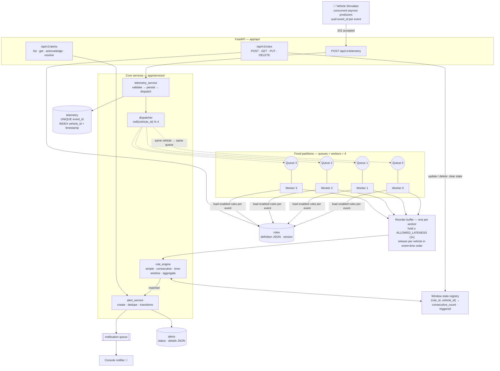

# Telematics Alert Rule Engine

Receives telemetry from many vehicles concurrently, evaluates configurable rules
asynchronously, and manages alert lifecycle. Built as a simple, production-aware
assignment implementation — no Kafka, Redis, Celery, Docker, or Kubernetes.

## Architecture



**Core principle:** same vehicle → same partition → one worker → sequential
processing and consistent state. Different vehicles → different partitions →
concurrent processing. Queue count is fixed; 100 or 100,000 vehicles use the
same 4 queues.

Detailed Mermaid diagrams (components, processing pipeline, sequence, data
model, alert lifecycle) are in [`diagrams/`](diagrams/).

## Run it

```bash
python -m venv .venv && source .venv/bin/activate
pip install -r requirements.txt

# terminal 1
uvicorn app.main:app --port 8000

# terminal 2 — scripted demo (creates a rule, sends scenarios, prints alerts)
python simulator/simulator.py

# load & verification test — see "Load & verification test" below
uvicorn app.main:app --port 8000
python simulator/generate_events.py
python simulator/replay.py

# tests
pytest
```

## Load & verification test

Generates a large dataset with the expected answers precomputed, replays it in
mixed-size concurrent batches, and verifies every alert:

```bash
# terminal 1 — default lateness is fine: stream mode keeps every vehicle
# in order, like a real ~1 event/second tracker
uvicorn app.main:app --port 8000

# terminal 2
python simulator/generate_events.py --vehicles 20 --events-per-vehicle 150   # 3000 events
python simulator/replay.py                                # stream mode (default)
python simulator/replay.py --order shuffled --lateness 30 # stress mode (see below)
```

`generate_events.py` writes `dataset/dataset.json`: the rules, the events
(4 driving scenarios round-robin across vehicles), and the expected alert for
every (rule, vehicle) pair that should fire — computed by an independent
simulation of the rule semantics. `replay.py` sends the events with 4
concurrent senders in batch sizes cycled from 250/50/400/10/150, then checks
that every expected alert fired exactly once at the exact expected timestamp
and nothing unexpected appeared.

Two send orders:

- **stream** (default): each vehicle is an independent in-order stream,
  vehicles spread across the senders — the production shape of the load
  (~1 event/s per vehicle; the only disorder is our own pipeline's).
  Passes on the default 2s lateness.
- **shuffled**: scrambles arrival so the same vehicle's events arrive seconds
  apart in the wrong order — deliberately exceeds the default lateness.
  Start the server with `ALLOWED_LATENESS_SECONDS=30` and pass
  `--lateness 30`, otherwise events are (correctly) dropped as late.

`--resend-first-batch` re-sends batch 0 to exercise idempotency; re-running
the same dataset sends all duplicate event_ids and must not change any alert.


## API

```
POST   /api/v1/telemetry            # 202 accepted (idempotent on event_id)
POST   /api/v1/rules                # create rule
GET    /api/v1/rules
GET    /api/v1/rules/{id}
PUT    /api/v1/rules/{id}           # bumps version, clears that rule's window state
DELETE /api/v1/rules/{id}
GET    /api/v1/alerts?status=&vehicle_id=
GET    /api/v1/alerts/{id}
POST   /api/v1/alerts/{id}/acknowledge
POST   /api/v1/alerts/{id}/resolve  # invalid transitions → 409
GET    /health
```

Example rule (no code changes needed to add new rules):

```json
{
  "name": "Persistent speeding",
  "rule_type": "windowed",
  "definition": {"field": "speed_mph", "operator": "GT", "value": 70, "consecutive_points": 3},
  "enabled": true
}
```

For `"rule_type": "simple"`, drop `consecutive_points`. Optional
`"target_vehicles": ["VIN001"]` on any rule restricts it to specific vehicles.
Operators: GT, GTE, LT, LTE, EQ, NEQ.

Four rule families, all defined as JSON (no code changes to add rules):

| `rule_type` | extra definition keys | fires when |
|---|---|---|
| `simple` | — | the current event matches |
| `windowed` | `consecutive_points: N` | all of the last N events match |
| `time_window` | `window_seconds: T, min_matches: K` | K events match inside any T-second span (non-consecutive) |
| `aggregate` | `agg_fn: AVG/MAX/MIN/SUM` + `window_seconds` and/or `window_points` | the aggregate over the window matches the threshold |

Example aggregate rule:

```json
{"name": "Sustained speed", "rule_type": "aggregate",
 "definition": {"field": "speed_mph", "agg_fn": "AVG", "operator": "GT",
                "value": 65, "window_seconds": 60}}
```

## Design notes

**Database is the source of durable truth; queues only process.**
Telemetry is persisted before being enqueued. A crash loses in-memory window
counts and buffered events, never telemetry or alerts; evaluation simply
restarts from count 0.

**Ingestion stays lightweight.** The endpoint validates, persists, and
enqueues — no rule evaluation, no history queries in the HTTP path. Queues are
bounded (`maxsize=1000`); when one is full the API returns 503. The event is
already in the database, so nothing is silently lost.

**Event-time ordering.** HTTP arrival order is not guaranteed to match
telemetry timestamps. Each worker holds events in a reorder buffer with a
per-vehicle watermark: a vehicle's whole backlog is released together, sorted
by timestamp, once its *oldest* held event has waited
`ALLOWED_LATENESS_SECONDS` (2s default). Any out-of-order arrival within the
lateness window is therefore still evaluated in event-time order. An event
older than the last processed one for its vehicle is logged and skipped — it
is never re-evaluated, which keeps window state consistent. Production could
instead replay/recompute the affected window. The lateness value is a
trade-off: it must exceed the arrival disorder you tolerate; larger windows
delay alerts, smaller ones drop more late events.

**Alerts vs. notifications.** An alert is business state, a notification is a
side effect. The alert row is committed first, then handed to the notification
queue (console print). A notification failure can never lose an alert. Swap
`app/notifications.py` for email/SMS/webhook.

**Rule lifecycle.** Rules are database rows evaluated by type
(`simple`/`windowed`). Updating or deleting a rule clears its window state, so
streaks never mix two definitions. Existing alerts are historical records and
are never auto-deleted by rule changes. Duplicate-alert backstop: at most one
active (non-RESOLVED) alert per `(rule_id, vehicle_id)`.

**Window state** lives at `(rule_id, vehicle_id)`: a bounded list of
`(timestamp, value)` pairs plus a `triggered` flag. Every event appends; each
rule type evicts by its own window (last N points, or newer than T seconds)
and applies its predicate (all-match, K-hits-in-window, aggregate). One
violation period fires one alert; the condition dropping re-arms it. Eviction
runs in event time, which the reorder buffer guarantees.

## Known limitations (intentional)

- **Tenant isolation:** fixed partitions mean one very large tenant can occupy
  queue capacity shared with others. Production would add tenant quotas,
  partition assignment, or dedicated worker pools.
- **Single-process state:** queues, buffers, and window state are in-memory.
  Multi-instance deployment would externalize them to a shared store/broker;
  the partitioning model stays the same.
- **SQLite** allows a single writer; this demonstrates correct ordering and
  concurrency design, not horizontal write scale. Set `DATABASE_URL` to a
  PostgreSQL URL (`postgresql+asyncpg://...`) and install `psycopg` /
  `asyncpg` — no code changes.
- **Rules are loaded per event.** A 2-second in-memory rule cache is the easy
  next step if event volume grows.
