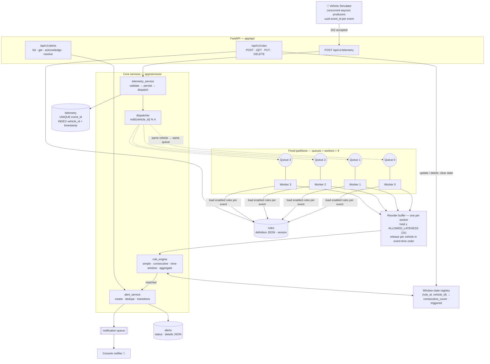

```mermaid
flowchart TB
    SIM["🚗 Vehicle Simulator<br/>concurrent asyncio producers<br/>uuid event_id per event"]

    subgraph API["FastAPI — app/api/"]
        direction LR
        TEL["POST /api/v1/telemetry"]
        RULES["/api/v1/rules<br/>POST · GET · PUT · DELETE"]
        ALRT["/api/v1/alerts<br/>list · get · acknowledge · resolve"]
    end

    subgraph CORE["Core services — app/services/"]
        ING["telemetry_service<br/>validate → persist → dispatch"]
        DISP["dispatcher<br/>md5(vehicle_id) % 4"]
        ENG["rule_engine<br/>simple · consecutive · time-window · aggregate"]
        ASVC["alert_service<br/>create · dedupe · transitions"]
    end

    subgraph FIXED["Fixed partitions — queues = workers = 4"]
        direction LR
        Q0(("Queue 0")) --- W0["Worker 0"]
        Q1(("Queue 1")) --- W1["Worker 1"]
        Q2(("Queue 2")) --- W2["Worker 2"]
        Q3(("Queue 3")) --- W3["Worker 3"]
    end

    RB["Reorder buffer — one per worker<br/>hold ≤ ALLOWED_LATENESS (2s)<br/>release per vehicle in event-time order"]
    WS["Window state registry<br/>(rule_id, vehicle_id) →<br/>consecutive_count · triggered"]
    NQ[["notification queue"]]
    CN["Console notifier 🚨"]

    DBT[("telemetry<br/>UNIQUE event_id<br/>INDEX vehicle_id + timestamp")]
    DBR[("rules<br/>definition JSON · version")]
    DBA[("alerts<br/>status · details JSON")]

    SIM -->|202 accepted| TEL
    TEL --> ING
    ING --> DBT
    ING --> DISP
    DISP -.->|same vehicle → same queue| Q0
    DISP -.-> Q1
    DISP -.-> Q2
    DISP -.-> Q3

    W0 & W1 & W2 & W3 --> RB
    RB --> ENG
    ENG <--> WS
    ENG -->|matched| ASVC
    ASVC --> DBA
    ASVC --> NQ --> CN
    W0 & W1 & W2 & W3 -->|load enabled rules per event| DBR

    RULES --> DBR
    RULES -->|update / delete: clear state| WS
    ALRT --> ASVC
```