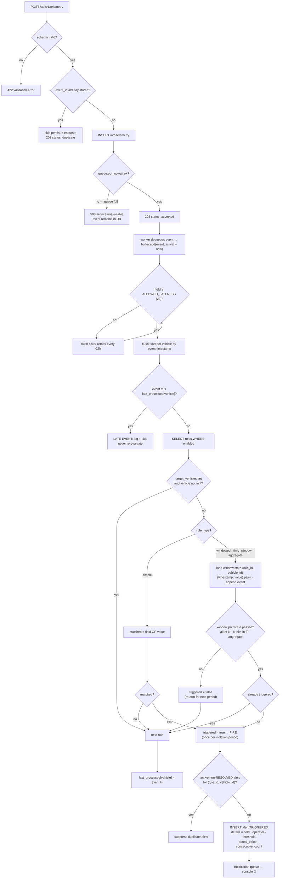

```mermaid
flowchart TD
    %% ---------- HTTP path ----------
    A["POST /api/v1/telemetry"] --> B{"schema valid?"}
    B -->|no| B1["422 validation error"]
    B -->|yes| C{"event_id already stored?"}
    C -->|yes| C1["skip persist + enqueue<br/>202 status: duplicate"]
    C -->|no| D["INSERT into telemetry"]
    D --> E{"queue.put_nowait ok?"}
    E -->|no — queue full| E1["503 service unavailable<br/>event remains in DB"]
    E -->|yes| F["202 status: accepted"]

    %% ---------- Worker path (inside the event's partition worker) ----------
    F --> G["worker dequeues event → buffer.add(event, arrival = now)"]
    G --> H{"held ≥ ALLOWED_LATENESS (2s)?"}
    H -->|no| H1["flush ticker retries every 0.5s"]
    H1 --> H
    H -->|yes| I["flush: sort per vehicle by event timestamp"]
    I --> J{"event ts ≤ last_processed[vehicle]?"}
    J -->|yes| J1["LATE EVENT: log + skip<br/>never re-evaluate"]
    J -->|no| K["SELECT rules WHERE enabled"]
    K --> L{"target_vehicles set<br/>and vehicle not in it?"}
    L -->|yes| M["next rule"]
    L -->|no| N{"rule_type?"}
    N -->|simple| O["matched = field OP value"]
    N -->|"windowed · time_window · aggregate"| P["load window state (rule_id, vehicle_id)<br/>(timestamp, value) pairs · append event"]
    P --> Q{"window predicate passed?<br/>all-of-N · K-hits-in-T · aggregate"}
    Q -->|no| Q1["triggered = false<br/>(re-arm for next period)"]
    Q -->|yes| R{"already triggered?"}
    R -->|yes| M
    R -->|no| R1["triggered = true → FIRE<br/>(once per violation period)"]
    O --> S{"matched?"}
    S -->|no| M
    S -->|yes| R1
    R1 --> T{"active non-RESOLVED alert<br/>for (rule_id, vehicle_id)?"}
    T -->|yes| T1["suppress duplicate alert"]
    T -->|no| U["INSERT alert TRIGGERED<br/>details = field · operator · threshold<br/>actual_value · consecutive_count"]
    U --> V["notification queue → console 🚨"]
    Q1 --> M
    M --> Z["last_processed[vehicle] = event ts"]
```