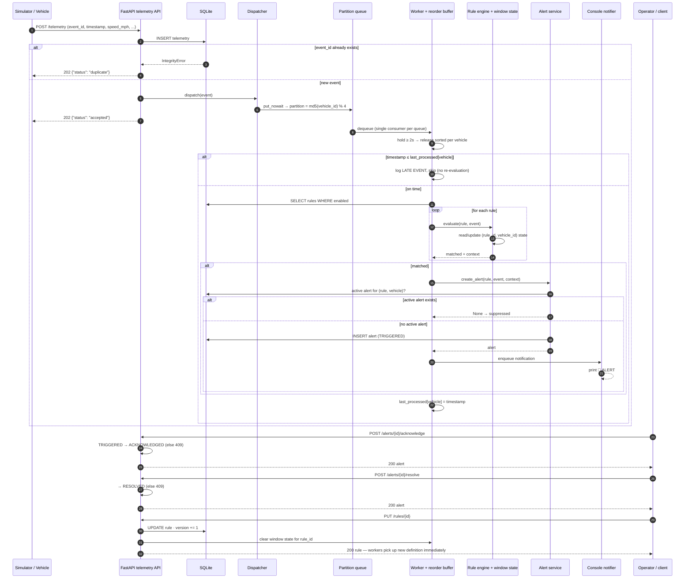

```mermaid
sequenceDiagram
    autonumber
    participant V as Simulator / Vehicle
    participant API as FastAPI telemetry API
    participant DB as SQLite
    participant D as Dispatcher
    participant Q as Partition queue
    participant W as Worker + reorder buffer
    participant RE as Rule engine + window state
    participant AS as Alert service
    participant N as Console notifier
    participant O as Operator / client

    V->>API: POST /telemetry (event_id, timestamp, speed_mph, ...)
    API->>DB: INSERT telemetry
    alt event_id already exists
        DB-->>API: IntegrityError
        API-->>V: 202 {"status": "duplicate"}
    else new event
        API->>D: dispatch(event)
        D->>Q: put_nowait → partition = md5(vehicle_id) % 4
        API-->>V: 202 {"status": "accepted"}
        Q->>W: dequeue (single consumer per queue)
        W->>W: hold ≥ 2s → release sorted per vehicle
        alt timestamp ≤ last_processed[vehicle]
            W->>W: log LATE EVENT, skip (no re-evaluation)
        else on time
            W->>DB: SELECT rules WHERE enabled
            loop for each rule
                W->>RE: evaluate(rule, event)
                RE->>RE: read/update (rule_id, vehicle_id) state
                RE-->>W: matched + context
            end
            alt matched
                W->>AS: create_alert(rule, event, context)
                AS->>DB: active alert for (rule, vehicle)?
                alt active alert exists
                    AS-->>W: None → suppressed
                else no active alert
                    AS->>DB: INSERT alert (TRIGGERED)
                    AS-->>W: alert
                    W->>N: enqueue notification
                    N-->>N: print 🚨 ALERT
                end
            end
            W->>W: last_processed[vehicle] = timestamp
        end
    end

    O->>API: POST /alerts/{id}/acknowledge
    API->>API: TRIGGERED → ACKNOWLEDGED (else 409)
    API-->>O: 200 alert
    O->>API: POST /alerts/{id}/resolve
    API->>API: → RESOLVED (else 409)
    API-->>O: 200 alert

    O->>API: PUT /rules/{id}
    API->>DB: UPDATE rule · version += 1
    API->>W: clear window state for rule_id
    API-->>O: 200 rule — workers pick up new definition immediately
```