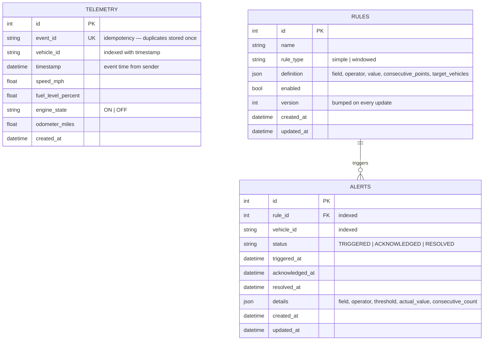

```mermaid
erDiagram
    TELEMETRY {
        int      id PK
        string   event_id UK "idempotency — duplicates stored once"
        string   vehicle_id "indexed with timestamp"
        datetime timestamp "event time from sender"
        float    speed_mph
        float    fuel_level_percent
        string   engine_state "ON | OFF"
        float    odometer_miles
        datetime created_at
    }
    RULES {
        int    id PK
        string name
        string rule_type "simple | windowed"
        json   definition "field, operator, value, consecutive_points, target_vehicles"
        bool   enabled
        int    version "bumped on every update"
        datetime created_at
        datetime updated_at
    }
    ALERTS {
        int      id PK
        int      rule_id FK "indexed"
        string   vehicle_id "indexed"
        string   status "TRIGGERED | ACKNOWLEDGED | RESOLVED"
        datetime triggered_at
        datetime acknowledged_at
        datetime resolved_at
        json     details "field, operator, threshold, actual_value, consecutive_count"
        datetime created_at
        datetime updated_at
    }
    RULES ||--o{ ALERTS : "triggers"
```