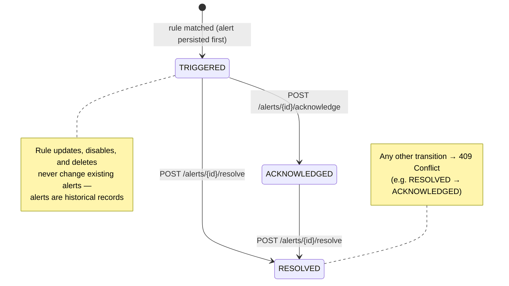

```mermaid
stateDiagram-v2
    [*] --> TRIGGERED : rule matched (alert persisted first)

    TRIGGERED --> ACKNOWLEDGED : POST /alerts/{id}/acknowledge
    TRIGGERED --> RESOLVED : POST /alerts/{id}/resolve
    ACKNOWLEDGED --> RESOLVED : POST /alerts/{id}/resolve

    note right of TRIGGERED
        Rule updates, disables, and deletes
        never change existing alerts —
        alerts are historical records
    end note

    note left of RESOLVED
        Any other transition → 409 Conflict
        (e.g. RESOLVED → ACKNOWLEDGED)
    end note
```